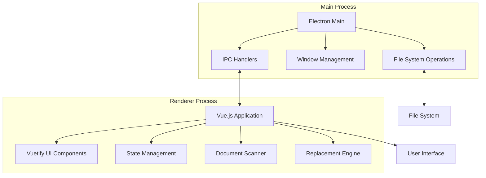
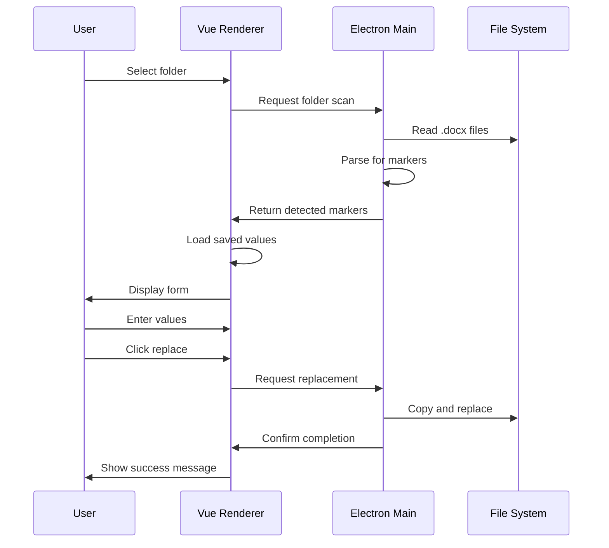

# Document Prefiller Application - Design Document

## 1. Project Overview and Goals

### 1.1 Purpose
The Document Prefiller is a desktop GUI application designed to streamline the process of prefilling Microsoft Word (.docx) documents with replacement markers. The application allows users to define replacement markers in their documents, provide values for those markers through a simple interface, and generate new documents with the replacements applied.

### 1.2 Primary Goals
- **Simplicity**: Provide an intuitive, user-friendly interface for document prefilling
- **Efficiency**: Enable batch processing of multiple documents with shared replacement values
- **Flexibility**: Support configurable marker prefixes to accommodate different naming conventions
- **Persistence**: Remember user preferences, last used folder, and replacement values between sessions
- **Reliability**: Accurately detect and replace markers while preserving document formatting

### 1.3 Target Users
- Office workers who frequently generate similar documents with variable content
- Template managers who maintain document templates with placeholder markers
- Anyone who needs to automate document generation with variable data

## 2. Technology Stack and Tooling

### 2.1 Core Technologies
- **TypeScript**: Primary language for type safety and better developer experience
- **Vue.js 3**: Progressive JavaScript framework for building the user interface
- **Electron**: Framework for building cross-platform desktop applications
- **Vuetify 3**: Material Design component library for Vue.js

### 2.2 Build and Development Tools
- **Vite**: Fast build tool and development server
- **ESLint**: Code linting and style enforcement
- **Vitest**: Unit testing framework
- **Yarn**: Package manager for dependency management

### 2.3 Additional Libraries (to be determined)
- **docx** or similar: For parsing and modifying .docx files
- **electron-store**: For persisting application settings
- **vue-router**: For potential future navigation needs

## 3. Architecture Overview

### 3.1 High-Level Architecture



### 3.2 Process Separation

#### Main Process (Electron)
- **Responsibilities**:
  - Application lifecycle management
  - Window creation and management
  - File system operations (reading/writing files)
  - Inter-Process Communication (IPC) coordination
  - Native OS integration (file dialogs, notifications)

#### Renderer Process (Vue.js)
- **Responsibilities**:
  - User interface rendering
  - User interaction handling
  - State management
  - Document scanning logic
  - Replacement value management
  - Communication with main process via IPC

### 3.3 Data Flow



## 4. Detailed Feature Specifications

### 4.1 Application Startup and Folder Selection

**Feature**: Initial folder selection prompt
- **Trigger**: Application launch
- **Behavior**:
  - If no previously saved folder exists, show folder selection dialog
  - If a saved folder exists, automatically open it
  - Remember last selected folder across sessions
- **User Experience**:
  - Clear prompt: "Select a folder containing .docx files to prefill"
  - Support for folder browsing dialog
  - Validation: Ensure folder contains at least one .docx file

### 4.2 Window State Persistence

**Feature**: Remember window size and position
- **Trigger**: Application close
- **Behavior**:
  - Save window dimensions (width, height)
  - Save window position (x, y coordinates)
  - Restore on next launch
- **Storage**: Electron store or similar persistence mechanism

### 4.3 Document Scanning

**Feature**: Detect replacement markers in .docx files
- **Trigger**: Folder selection or manual refresh
- **Behavior**:
  - Scan all .docx files in selected folder
  - Extract text content from documents
  - Identify markers matching configured prefix pattern
  - Deduplicate markers across all documents
  - Always rescan on folder open (markers may have changed)
- **Marker Pattern**: `{prefix}{identifier}` where:
  - `prefix`: Configurable string (default: "REPLACEME-")
  - `identifier`: Alphanumeric string (e.g., "WORD", "NAME", "DATE")
- **Start Simple**: A docx file is just a zipped XML document. 
  - To parse it, just unzip it and then use regex to find/replace replacement markers. 


### 4.4 Replacement Value Management

**Feature**: Display and manage replacement values
- **UI Components**:
  - List of detected markers
  - Text input field for each marker
  - Visual indicators for marker status
- **Marker States**:
  - **Active**: Marker detected in current documents
  - **New**: Marker detected but not in save file (highlighted)
  - **Removed**: Marker in save file but not detected (greyed out)
- **Value Handling**:
  - Empty values: Remove the marker from document
  - Non-empty values: Replace marker with provided text
  - Values persist in save file for next session

### 4.5 Save File Management

**Feature**: `.replacement-values.json` file
- **Location**: Same folder as .docx files
- **Structure**:
  ```json
  {
    "prefix": "REPLACEME-",
    "values": {
      "WORD": "replacement text",
      "NAME": "John Doe",
      "DATE": "2024-01-15"
    },
    "version": "1.0"
  }
  ```
- **Behavior**:
  - Created on first save
  - Updated when values change
  - Loaded on folder open to prefill form
  - Removed markers are cleaned up after replacement

### 4.6 Document Replacement

**Feature**: Generate documents with replacements
- **Trigger**: User clicks "Replace" button
- **Workflow**:
  1. Prompt user to select output folder
  2. Copy all .docx files to output folder
  3. For each document:
     - Parse document structure
     - Replace all markers with corresponding values
     - Preserve formatting and document structure
     - Save to output folder
  4. Clean up removed markers from save file
  5. Show success message with count of processed documents
- **Error Handling**:
  - Validate output folder is writable
  - Handle file copy errors gracefully
  - Show clear error messages for failures

### 4.7 Marker Prefix Configuration

**Feature**: Configurable marker prefix
- **Default**: "REPLACEME-"
- **Scope**: Folder-specific (saved in `.replacement-values.json`)
- **Configuration**:
  - UI field to change prefix
  - Validation: Must be non-empty string
  - Rescan documents when prefix changes
- **Use Cases**:
  - Different teams use different marker conventions
  - Avoid conflicts with other text patterns

## 5. Data Models and File Formats

### 5.1 Replacement Values File

**File**: `.replacement-values.json`

**Schema**:
```typescript
interface ReplacementValuesFile {
  prefix: string;              // Marker prefix (e.g., "REPLACEME-")
  values: Record<string, string>;  // Key: identifier, Value: replacement text
  version: string;             // File format version
  lastModified?: string;       // ISO timestamp of last modification
}
```

**Example**:
```json
{
  "prefix": "REPLACEME-",
  "values": {
    "WORD": "example",
    "NAME": "Jane Smith",
    "DATE": "2024-02-05",
    "COMPANY": "Acme Corp"
  },
  "version": "1.0",
  "lastModified": "2024-02-05T06:58:33.420Z"
}
```

### 5.2 Application Settings

**Storage**: Electron store (platform-specific location)

**Schema**:
```typescript
interface AppSettings {
  lastFolder?: string;         // Last selected folder path
  windowState: {
    width: number;
    height: number;
    x?: number;
    y?: number;
    maximized?: boolean;
  };
  preferences: {
    defaultPrefix?: string;    // Default prefix for new folders
  };
}
```

### 5.3 Marker Data Model

```typescript
interface Marker {
  identifier: string;          // The identifier part (e.g., "WORD")
  fullMarker: string;          // Full marker including prefix (e.g., "REPLACEME-WORD")
  value: string;               // Current replacement value
  status: 'active' | 'new' | 'removed';
  documents: string[];         // List of documents containing this marker
}
```

### 5.4 Document Scan Result

```typescript
interface ScanResult {
  folder: string;              // Scanned folder path
  documents: string[];         // List of .docx files found
  markers: Marker[];           // Detected markers
  prefix: string;              // Prefix used for scanning
  timestamp: string;           // Scan timestamp
}
```

## 6. UI/UX Design Considerations

### 6.1 Layout Structure

```
┌─────────────────────────────────────────────────┐
│  Document Prefiller                    [─][□][×]│
├─────────────────────────────────────────────────┤
│  Folder: /path/to/documents          [Change]   │
│  Prefix: [REPLACEME-________]                    │
├─────────────────────────────────────────────────┤
│  Detected Markers (5)                            │
│  ┌───────────────────────────────────────────┐  │
│  │ REPLACEME-WORD    [example___________]   │  │
│  │ REPLACEME-NAME    [John Doe__________]   │  │
│  │ *REPLACEME-DATE   [2024-02-05________]   │  │
│  │ REPLACEME-ADDR    [__________________]   │  │
│  │ REMOVED-OLD       [old value_________]   │  │
│  └───────────────────────────────────────────┘  │
├─────────────────────────────────────────────────┤
│  Documents: 3 .docx files                       │
│  ┌───────────────────────────────────────────┐  │
│  │ • template.docx                           │  │
│  │ • contract.docx                           │  │
│  │ • letter.docx                             │  │
│  └───────────────────────────────────────────┘  │
├─────────────────────────────────────────────────┤
│  [Refresh]                    [Replace...]      │
└─────────────────────────────────────────────────┘
```

### 6.2 Visual Design Principles

- **Clean and Minimal**: Focus on the task at hand without clutter
- **Clear Hierarchy**: Important actions (Replace) prominently displayed
- **Visual Feedback**: Clear indicators for marker states
- **Responsive**: Adapts to different window sizes
- **Accessible**: Keyboard navigation and screen reader support

### 6.3 Color Scheme

- **Primary**: Blue (#1976D2) - Main actions and active elements
- **Success**: Green (#4CAF50) - Success messages and completed states
- **Warning**: Orange (#FF9800) - New markers
- **Disabled**: Grey (#9E9E9E) - Removed markers
- **Error**: Red (#F44336) - Error messages
- **Background**: White (#FFFFFF) - Main content area
- **Surface**: Light Grey (#F5F5F5) - Secondary areas

### 6.4 User Interaction Patterns

#### Folder Selection
- Button: "Change Folder" or "Select Folder"
- Dialog: Native folder picker
- Validation: Show error if no .docx files found

#### Marker Input
- Text fields: Auto-focus on first marker
- Tab navigation: Move between markers
- Enter key: Move to next marker
- Auto-save: Save values on blur or after debounce

#### Replacement Action
- Button: "Replace..." (ellipsis indicates dialog)
- Dialog: Output folder selection
- Progress: Show progress indicator during replacement
- Completion: Success message with document count

#### Marker Status Indicators
- **New markers**: Asterisk (*) or different color
- **Removed markers**: Greyed out with strikethrough
- **Active markers**: Normal appearance

### 6.5 Error Handling UI

- **Inline errors**: Show below relevant field
- **Modal dialogs**: For critical errors blocking operation
- **Toast notifications**: For non-critical information
- **Loading states**: Spinners or progress bars during operations

## 7. Project Structure and File Organization

### 7.1 Directory Structure

```
document-prefiller/
├── src/
│   ├── main/                    # Electron main process
│   │   ├── index.ts            # Main entry point
│   │   ├── window.ts           # Window management
│   │   ├── ipc/                # IPC handlers
│   │   │   ├── handlers.ts     # IPC handler registration
│   │   │   ├── folder.ts       # Folder operations
│   │   │   ├── document.ts     # Document operations
│   │   │   └── settings.ts     # Settings operations
│   │   ├── services/           # Business logic
│   │   │   ├── scanner.ts      # Document scanner
│   │   │   ├── replacer.ts     # Replacement engine
│   │   │   └── storage.ts      # File storage operations
│   │   └── utils/              # Utility functions
│   │       └── file.ts         # File utilities
│   │
│   ├── renderer/                # Vue.js renderer process
│   │   ├── main.ts             # Renderer entry point
│   │   ├── App.vue             # Root component
│   │   ├── components/         # Vue components
│   │   │   ├── MarkerList.vue  # Marker list component
│   │   │   ├── MarkerItem.vue  # Individual marker item
│   │   │   ├── DocumentList.vue # Document list component
│   │   │   ├── FolderSelector.vue # Folder selection
│   │   │   └── PrefixInput.vue  # Prefix configuration
│   │   ├── composables/        # Vue composables
│   │   │   ├── useMarkers.ts   # Marker state management
│   │   │   ├── useDocuments.ts # Document state management
│   │   │   └── useSettings.ts  # Settings state management
│   │   ├── stores/             # Pinia stores (if needed)
│   │   │   └── app.ts          # Application state
│   │   ├── types/              # TypeScript types
│   │   │   └── index.ts        # Shared type definitions
│   │   └── assets/             # Static assets
│   │       └── styles/         # CSS/SCSS files
│   │
│   ├── shared/                 # Shared code between processes
│   │   ├── types/              # Shared TypeScript types
│   │   │   └── index.ts
│   │   └── constants/          # Shared constants
│   │       └── index.ts
│   │
│   └── preload/                # Preload script
│       └── index.ts            # Context bridge setup
│
├── tests/                      # Test files
│   ├── unit/                   # Unit tests
│   │   ├── scanner.test.ts
│   │   ├── replacer.test.ts
│   │   └── storage.test.ts
│   └── e2e/                    # End-to-end tests
│       └── app.test.ts
│
├── public/                     # Public assets
│   └── icons/                  # Application icons
│
├── .eslintrc.cjs              # ESLint configuration
├── .gitignore                 # Git ignore rules
├── package.json               # Project dependencies
├── tsconfig.json              # TypeScript configuration
├── vite.config.ts             # Vite configuration
├── vitest.config.ts           # Vitest configuration
├── electron.vite.config.ts    # Electron Vite configuration
└── README.md                  # Project documentation
```

### 7.2 File Naming Conventions

- **Components**: PascalCase (e.g., `MarkerList.vue`)
- **Composables**: camelCase with `use` prefix (e.g., `useMarkers.ts`)
- **Services**: camelCase (e.g., `scanner.ts`)
- **Types**: camelCase (e.g., `index.ts`)
- **Utilities**: camelCase (e.g., `file.ts`)
- **Constants**: UPPER_SNAKE_CASE (e.g., `index.ts`)

### 7.3 Code Organization Principles

- **Separation of Concerns**: Clear separation between main and renderer processes
- **Single Responsibility**: Each file/module has a single, well-defined purpose
- **Dependency Direction**: Renderer depends on shared, main depends on shared
- **Type Safety**: Shared types defined in `src/shared/types/`
- **Reusability**: Common utilities in `src/shared/utils/`

## 8. Development Phases and Implementation Plan

### 8.1 Phase 1: Project Setup and Infrastructure

**Goals**: Establish project foundation and development environment

**Tasks**:
1. Initialize project with Vite + Electron + Vue.js
2. Configure TypeScript and ESLint
3. Set up Vuetify integration
4. Configure Vitest for testing
5. Create basic project structure
6. Set up development and build scripts
7. Configure Electron preload script and context bridge

**Deliverables**:
- Working development environment
- Basic Electron app with Vue.js renderer
- Configured tooling (ESLint, Vitest)
- Project structure in place

### 8.2 Phase 2: Core Data Models and Types

**Goals**: Define data structures and type definitions

**Tasks**:
1. Define TypeScript interfaces for all data models
2. Create shared types package
3. Define IPC message types
4. Create constants file
5. Set up type validation utilities

**Deliverables**:
- Complete type definitions
- Shared types module
- IPC message contracts

### 8.3 Phase 3: Main Process - File System Operations

**Goals**: Implement file system access and document parsing

**Tasks**:
1. Implement folder scanning logic
2. Implement .docx file parsing
3. Create marker detection algorithm
4. Implement file copy operations
5. Create save file read/write operations
6. Implement window state persistence
7. Set up IPC handlers for file operations

**Deliverables**:
- Document scanner service
- File storage service
- IPC handlers for file operations
- Window state management

### 8.4 Phase 4: Main Process - Replacement Engine

**Goals**: Implement document replacement logic

**Tasks**:
1. Research and select .docx manipulation library
2. Implement marker replacement algorithm
3. Handle text replacement while preserving formatting
4. Implement batch document processing
5. Add error handling for malformed documents
6. Create progress tracking for replacements

**Deliverables**:
- Replacement engine service
- Document processing pipeline
- Error handling and recovery

### 8.5 Phase 5: Renderer Process - UI Components

**Goals**: Build user interface components

**Tasks**:
1. Create root App.vue component
2. Implement folder selector component
3. Create marker list component
4. Implement marker item component
5. Create document list component
6. Implement prefix input component
7. Add loading and error states
8. Implement responsive layout

**Deliverables**:
- Complete UI component library
- Responsive layout
- Loading and error states

### 8.6 Phase 6: Renderer Process - State Management

**Goals**: Implement application state and business logic

**Tasks**:
1. Create composables for marker management
2. Create composables for document management
3. Create composables for settings management
4. Implement IPC communication layer
5. Add state persistence logic
6. Implement marker status tracking (new/removed/active)
7. Add form validation

**Deliverables**:
- State management composables
- IPC communication layer
- Form validation logic

### 8.7 Phase 7: Integration and User Flow

**Goals**: Connect all components and implement complete user flow

**Tasks**:
1. Integrate main and renderer processes
2. Implement folder selection flow
3. Implement document scanning flow
4. Implement value entry flow
5. Implement replacement flow
6. Add auto-save functionality
7. Implement window state persistence
8. Add keyboard navigation

**Deliverables**:
- Complete user flow implementation
- Integrated application
- Keyboard navigation support

### 8.8 Phase 8: Polish and Refinement

**Goals**: Improve UX and add finishing touches

**Tasks**:
1. Add visual feedback for all actions
2. Implement toast notifications
3. Add confirmation dialogs
4. Improve error messages
5. Add loading indicators
6. Implement undo/redo (if feasible)
7. Add keyboard shortcuts

**Deliverables**:
- Polished user experience
- Comprehensive error handling

### 8.9 Phase 9: Testing

**Goals**: Ensure application reliability and correctness

**Tasks**:
1. Write unit tests for scanner service
2. Write unit tests for replacement engine
3. Write unit tests for storage operations
4. Write component tests for UI components
5. Write integration tests for user flows
6. Write E2E tests for critical paths
7. Add test fixtures and mock data
8. Set up CI/CD for automated testing

**Deliverables**:
- Comprehensive test suite
- Test coverage report
- CI/CD pipeline

### 8.10 Phase 10: Documentation and Deployment

**Goals**: Prepare for distribution

**Tasks**:
1. Write user documentation
2. Create README with setup instructions
3. Add in-app help or tooltips
4. Configure build for different platforms
5. Create application icons
6. Set up code signing (if needed)
7. Create installer packages
8. Test on target platforms

**Deliverables**:
- User documentation
- README file
- Application installers
- Platform-specific builds

## 9. Testing Strategy

### 9.1 Unit Testing

**Scope**: Individual functions and classes in isolation

**Tools**: Vitest

**Areas to Test**:
- **Scanner Service**:
  - Marker detection with various prefixes
  - Document parsing edge cases
  - Empty document handling
  - Malformed document handling

- **Replacement Engine**:
  - Simple text replacement
  - Multiple occurrences of same marker
  - Empty value handling (marker removal)
  - Formatting preservation
  - Special character handling

- **Storage Service**:
  - Save file creation
  - Save file reading
  - Save file updating
  - Invalid file handling
  - Missing file handling

- **Utilities**:
  - File path operations
  - String manipulation
  - Validation functions

**Coverage Goal**: >80% code coverage

### 9.2 Component Testing

**Scope**: Vue components in isolation

**Tools**: Vitest + Vue Test Utils

**Areas to Test**:
- **MarkerList Component**:
  - Renders correct number of markers
  - Displays marker status correctly
  - Handles empty state
  - Emits correct events

- **MarkerItem Component**:
  - Displays marker and value
  - Handles value changes
  - Shows correct status styling
  - Handles keyboard events

- **FolderSelector Component**:
  - Displays current folder
  - Opens folder dialog on click
  - Handles folder selection
  - Shows error state

- **PrefixInput Component**:
  - Displays current prefix
  - Handles prefix changes
  - Validates input
  - Emits change events

### 9.3 Integration Testing

**Scope**: Interaction between multiple components/services

**Tools**: Vitest

**Areas to Test**:
- **Folder Selection Flow**:
  - User selects folder
  - Scanner detects documents
  - UI displays markers
  - Save file is loaded

- **Replacement Flow**:
  - User enters values
  - User clicks replace
  - Output folder is selected
  - Documents are processed
  - Save file is updated

- **State Persistence**:
  - Values are saved to file
  - Values are loaded on reopen
  - Window state is saved/restored

### 9.4 End-to-End Testing

**Scope**: Complete user workflows from start to finish

**Tools**: Playwright or Spectron

**Test Scenarios**:
1. **First-Time User Flow**:
   - Launch application
   - Select folder with documents
   - View detected markers
   - Enter replacement values
   - Perform replacement
   - Verify output documents

2. **Returning User Flow**:
   - Launch application
   - Auto-open last folder
   - Verify saved values are loaded
   - Modify values
   - Perform replacement
   - Verify updates are saved

3. **Prefix Change Flow**:
   - Open folder with documents
   - Change marker prefix
   - Verify markers are rescanned
   - Enter values
   - Perform replacement
   - Verify prefix is saved

4. **Error Handling Flow**:
   - Select folder without .docx files
   - Verify error message
   - Select invalid output folder
   - Verify error message
   - Handle malformed document

### 9.5 Manual Testing Checklist

**Functional Testing**:
- [ ] Application launches without errors
- [ ] Folder selection dialog opens correctly
- [ ] Documents are scanned and markers detected
- [ ] Markers are displayed correctly
- [ ] Values can be entered and edited
- [ ] Empty values remove markers
- [ ] Replacement process completes successfully
- [ ] Output documents contain correct replacements
- [ ] Save file is created and updated
- [ ] Window state is saved and restored
- [ ] Prefix can be changed
- [ ] New markers are highlighted
- [ ] Removed markers are greyed out

**UI/UX Testing**:
- [ ] Layout is responsive
- [ ] All buttons are clickable
- [ ] Keyboard navigation works
- [ ] Loading states are shown
- [ ] Error messages are clear
- [ ] Success messages are shown
- [ ] Visual indicators are clear
- [ ] Colors are accessible

**Edge Cases**:
- [ ] Empty folder
- [ ] Folder with no .docx files
- [ ] Folder with corrupted .docx files
- [ ] Very large documents
- [ ] Many documents (100+)
- [ ] Many markers (100+)
- [ ] Very long replacement values
- [ ] Special characters in values
- [ ] Unicode characters in values
- [ ] Network drive paths
- [ ] Read-only folders
- [ ] Insufficient disk space

**Cross-Platform Testing**:
- [ ] Windows 10/11
- [ ] macOS (Intel and Apple Silicon)
- [ ] Linux (Ubuntu, Fedora, etc.)

### 9.6 Test Data

**Test Documents**:
- Simple document with few markers
- Complex document with many markers
- Document with nested formatting
- Document with tables
- Document with images
- Document with headers/footers
- Document with multiple sections
- Empty document
- Corrupted document

**Test Markers**:
- Standard markers: `REPLACEME-WORD`, `REPLACEME-NAME`
- Markers with numbers: `REPLACEME-123`, `REPLACEME-DATE-2024`
- Markers with underscores: `REPLACEME-FIRST_NAME`
- Custom prefix markers: `CUSTOM-VALUE`, `PREFIX-ITEM`

## 10. Future Enhancements

### 10.1 Potential Features

**Advanced Marker Support**:
- Regular expression-based marker patterns
- Conditional markers (only replace if condition met)
- Marker validation rules (e.g., date format, email format)
- Marker dependencies (one marker's value affects another)

**Document Management**:
- Support for additional file formats (.doc, .odt, .pdf)
- Document preview before replacement
- Batch processing of multiple folders
- Document templates library

**User Experience**:
- Dark mode theme
- Customizable UI layouts
- Keyboard shortcuts customization
- Multi-language support (i18n)

**Data Management**:
- Import/export replacement values
- Value history and versioning
- Value suggestions based on previous entries
- Value templates for common use cases

**Integration**:
- Cloud storage integration (Google Drive, Dropbox, OneDrive)
- API for programmatic access
- Command-line interface
- Browser extension for web-based document editing

### 10.2 Technical Improvements

**Performance**:
- Incremental scanning (only scan changed files)
- Caching of parsed documents
- Parallel document processing
- Lazy loading of large document sets

**Security**:
- Encryption of sensitive replacement values
- Secure file handling for confidential documents
- Audit logging of all operations
- User authentication and permissions

**Developer Experience**:
- Plugin system for custom functionality
- Extensible marker processors
- Debug mode with detailed logging
- Performance profiling tools

## 11. Risk Assessment

### 11.1 Technical Risks

| Risk | Likelihood | Impact | Mitigation |
|------|------------|--------|------------|
| .docx parsing library limitations | Medium | High | Evaluate multiple libraries, implement fallback strategies |
| Document formatting corruption | Low | High | Thorough testing, backup original files, preserve formatting |
| Large file performance issues | Medium | Medium | Implement streaming, progress indicators, async processing |
| Cross-platform compatibility issues | Medium | Medium | Test on all target platforms, use Electron's cross-platform APIs |
| File system permission errors | Low | Medium | Graceful error handling, clear user messages |

### 11.2 User Experience Risks

| Risk | Likelihood | Impact | Mitigation |
|------|------------|--------|------------|
| Confusing marker status indicators | Low | Medium | Clear visual design, tooltips, help documentation |
| Data loss from accidental overwrites | Low | High | Confirmation dialogs, backup creation, undo functionality |
| Poor performance with many documents | Medium | Medium | Progress indicators, async operations, performance testing |
| Difficult to understand error messages | Medium | Low | User-friendly error messages, suggested actions |

### 11.3 Project Risks

| Risk | Likelihood | Impact | Mitigation |
|------|------------|--------|------------|
| Scope creep | Medium | Medium | Clear MVP definition, phased development approach |
| Third-party library deprecation | Low | Medium | Choose stable, well-maintained libraries, monitor updates |
| Testing coverage gaps | Medium | Medium | Comprehensive test strategy, CI/CD integration |
| Documentation incomplete | Medium | Low | Documentation as part of development process |

## 12. Success Criteria

### 12.1 Functional Requirements

- [ ] Application successfully launches on Windows, macOS, and Linux
- [ ] Users can select folders containing .docx files
- [ ] Application detects all replacement markers in documents
- [ ] Users can enter replacement values for all detected markers
- [ ] Replacement process generates correct output documents
- [ ] Save file is created and updated correctly
- [ ] Window state is saved and restored between sessions
- [ ] Marker prefix can be configured and saved
- [ ] New markers are visually indicated
- [ ] Removed markers are greyed out
- [ ] Empty values remove markers from documents

### 12.2 Quality Requirements

- [ ] Unit test coverage >80%
- [ ] All critical user flows have E2E tests
- [ ] No critical bugs in production
- [ ] Application handles edge cases gracefully
- [ ] Error messages are clear and actionable
- [ ] Performance is acceptable for typical use cases (100+ documents, 100+ markers)

### 12.3 User Experience Requirements

- [ ] Application is intuitive for first-time users
- [ ] Common tasks can be completed in <3 clicks
- [ ] Loading states are clearly indicated
- [ ] Keyboard navigation works throughout the application
- [ ] Visual feedback is provided for all user actions
- [ ] Application is responsive on different screen sizes

### 12.4 Platform Requirements

- [ ] Windows 10/11 support
- [ ] macOS (Intel and Apple Silicon) support
- [ ] Linux (Ubuntu, Fedora, Debian) support
- [ ] Application installers for all platforms
- [ ] Code signing for Windows and macOS (if applicable)

---

**Document Version**: 1.0
**Last Updated**: 2024-02-05
**Status**: Ready for Implementation
