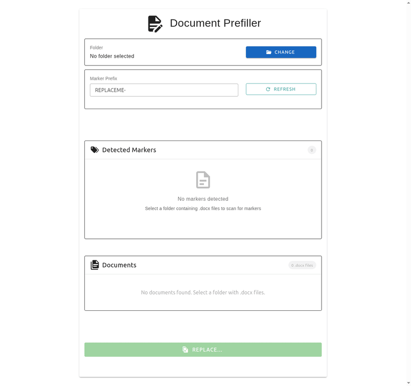

# Document Prefiller
> **Note:** This project was heavily built with AI assistance.

A desktop application for prefilling Microsoft Word (.docx) documents with replacement markers. Streamline your document generation workflow by defining markers in your templates and replacing them with custom values through an intuitive interface.

## Try it on the web

You can use Document Prefiller directly in your browser at <https://abraemer.github.io/document-prefiller/>. No installation is required.

> **Warning:** Functionality in the web app is a bit *browser-dependent*. Full live‑folder access works best in Chrome or Edge; other browsers operate from uploaded copies. The native desktop app provides more consistent behavior and additional features.

For a quick comparison of capabilities, see the [Web app vs. native app](#web-app-vs-native-app) feature matrix below. To download the native application, use the same [latest release] link as below.

## Privacy

Everything stays local. Your documents are never uploaded to any server — there is no server.

- **Desktop app:** your files are read from and written to your disk directly.
- **Web app:** a static site with no backend. Your documents are copied into your browser's local storage and processed entirely inside the browser; results are delivered as a local download. The only network traffic is fetching the app itself (and checking for a newer version).
- **Saved values** also stay on your device — as `.replacement-values.json` in the document folder (desktop) or in the browser's local storage (web).

## Features

- **Simple Document Scanning**: Automatically detects replacement markers in .docx files.
- **Configurable Markers**: Support for custom marker prefixes (default: `REPLACEME-`).
- **Batch Processing**: Process multiple documents with shared replacement values.
- **Value Persistence**: Save and load replacement values between sessions.
- **Window State Memory**: Remembers window size, position, and last used folder.
- **Cross-Platform**: Works on Windows, macOS, and Linux.
- **Clean UI**: Built with Vue.js 3 and Vuetify 3 for a modern, responsive interface.
- **Automatic Updates**: The app checks GitHub for new versions at launch.

## Installation

Download the prebuilt binary from the [latest release](https://github.com/abraemer/document-prefiller/releases/latest) for your platform.

You can also use the web app at https://abraemer.github.io/document-prefiller/ as a zero-install alternative.

## Quick start

New to Document Prefiller? Walk through the **[step-by-step tutorial](docs/tutorial/README.md)** with ready-made example documents.

1. Launch the application.
2. Select a folder containing your .docx templates.
3. The app scans and lists detected markers.
4. Enter replacement values for each marker.
5. Click **Replace** to generate documents.
6. Values are remembered for the next session.

To make your own templates, open an existing .docx in Word and type a marker such as `REPLACEME-NAME` wherever a value should be filled in later. When the app replaces markers it writes a copy of your template and inserts the plain replacement text only — the template's original formatting (styles, tables, images, etc.) is preserved.

Example marker: `REPLACEME-NAME` – see the full marker format rules in the [markers reference](docs/markers.md).

## Web app vs. native app

| Native app | Chrome / Edge | Firefox | Safari & others |
|---|---|---|---|
| Open template folder: native dialog | live folder, File System Access | folder upload | folder upload |
| Template source: your disk — always current | your disk — always current | browser copy (snapshot) | browser copy (snapshot) |
| Disk edits visible after rescan: yes | yes | no — re-upload to sync | no — re-upload to sync |
| Output delivery: written to an output folder, opened for you | ZIP download | ZIP download | ZIP download |
| Saved values: .replacement-values.json in the folder | in the browser + inside the ZIP | in the browser + inside the ZIP | in the browser + inside the ZIP — first upload may miss the values file |
| Auto-update: built-in | current (≤10 min cache lag) | current (≤10 min cache lag) | current (≤10 min cache lag) |
| Requirement: Windows/macOS/Linux | desktop Chrome or Edge | Firefox 95+ | macOS Safari 16.4+ / iOS 18.4+ |

[More details](docs/web.md)

## Documentation

- [Step-by-step tutorial](docs/tutorial/README.md)
- [Marker reference](docs/markers.md)
- [Auto‑update behavior](docs/auto-update.md)
- [Development guide](docs/development.md)
- [Contributing guide](CONTRIBUTING.md)

## License

This project is licensed under the MIT License - see the [LICENSE](LICENSE) file for details.

## Support

For issues, questions, or suggestions, open an issue on [GitHub](https://github.com/abraemer/document-prefiller/issues).